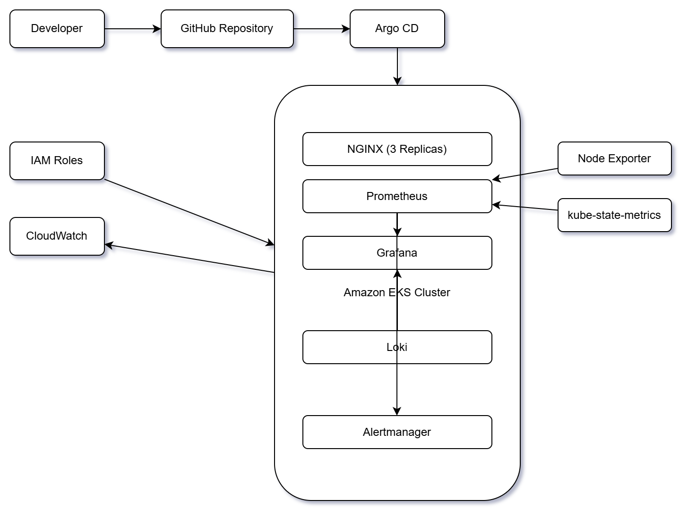

# Ciroos Observability Challenge

Production-inspired Kubernetes observability platform built on **Amazon EKS** using **Terraform**, **GitOps (Argo CD)**, **Prometheus**, and **Grafana**.

The objective of this project is to demonstrate Infrastructure as Code, GitOps deployment, Kubernetes monitoring, and observability best practices.

---

# Technology Stack

| Category | Tools |
|----------|------|
| Cloud | AWS |
| Infrastructure | Terraform |
| Container Platform | Amazon EKS |
| Container Runtime | Kubernetes |
| GitOps | Argo CD |
| Monitoring | Prometheus |
| Visualization | Grafana |
| Sample Application | NGINX |

---

# Architecture

The infrastructure follows a GitOps workflow.

```
Developer
      │
      ▼
 GitHub Repository
      │
      ▼
    Argo CD
      │
      ▼
 Amazon EKS Cluster
      │
      ▼
 Kubernetes Resources
      │
      ▼
 Prometheus
      │
      ▼
 Grafana
```

## Architecture Diagram



---

# Repository Structure

```
.
├── apps/
│   └── nginx/
├── terraform/
├── docs/
├── screenshots/
├── README.md
├── high-level-architecture.md
└── repository-folder-structure.md
```

---

# Deployment Workflow

1. Provision AWS infrastructure using Terraform

2. Deploy Amazon EKS

3. Install Argo CD

4. Connect GitHub Repository

5. Deploy NGINX through GitOps

6. Install kube-prometheus-stack

7. Monitor workloads using Prometheus and Grafana

---

# GitOps Deployment

Argo CD continuously watches the GitHub repository.

Any Git commit automatically synchronizes Kubernetes resources inside Amazon EKS.

### Argo CD


---

# Kubernetes Deployment

NGINX application running inside Kubernetes.

### kubectl


---

# Monitoring

## Prometheus Targets

All monitoring targets are healthy.


---

## Grafana Dashboard

Cluster monitoring dashboard.


---

## Kubernetes Namespace Dashboard

Resource utilization of deployed workloads.


---

# EKS Cluster

Worker nodes running successfully.


---

# GitHub Repository

Source code managed using Git.


---

# Validation

The following components were successfully validated.

- Terraform infrastructure deployment

- Amazon EKS cluster

- Kubernetes application deployment

- GitOps synchronization

- Prometheus metrics collection

- Grafana dashboards

- Kubernetes service discovery

- Automatic reconciliation using Argo CD

---

# Future Improvements

- AWS Load Balancer Controller

- AWS WAF Integration

- Loki Log Aggregation

- Alertmanager Notifications

- Multi-region EKS Deployment

- Centralized Logging

- Distributed Tracing

- Chaos Engineering

---

# Author

**Mohd. Maaz Ansari**

DevOps Engineer

AWS • Kubernetes • Terraform • GitOps • Prometheus • Grafana